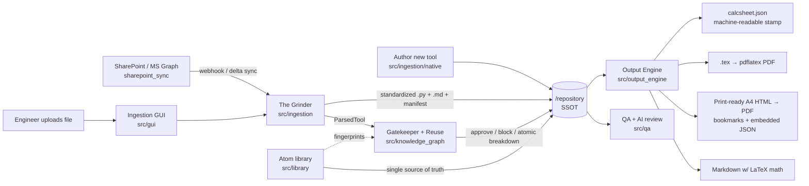

# AI-Augmented Structural Engineering Toolchain — Architecture

## Purpose

Convert legacy engineering calculation files (Mathcad, Excel, Python,
Jupyter) into a single version-controlled repository of standardized
Python tools paired with strict Markdown documentation, guarded by an AI
gatekeeper against duplication, and rendered into Mathcad-like A4 reports
for non-coder review.

## Module Map



## Core Design Decision: Calculation IS Visualization

The single source of truth for every tool is a `CalcSheet`
(`src/models/calculation.py`). Each `sheet.calc("w_k", "s_r_max*(eps_sm-eps_cm)")`
call simultaneously:

1. **evaluates** the expression numerically (via sympy),
2. stores the **symbolic LaTeX** form,
3. stores the **substituted LaTeX** form (values injected into the formula).

Renderers never re-implement math: they only walk the sheet. Change an
input, re-render, and every number in the Markdown/HTML/LaTeX report
updates — exactly like a Mathcad worksheet, never a stale `print()`.

**Faithful display.** Numbers are computed from an evaluated parse, but
the *displayed* formula comes from a separate non-evaluated parse
(`_parse_display`, using sympy's `evaluate(False)`), so a formula renders
the way it was written — `sqrt(28/t)` stays `√(28/t)` instead of being
auto-rewritten to `2·√7·√(1/t)`. Atoms preserve their original source
string and rename symbols textually for the same reason.

### Report path to PDF (non-coder workflow)

| Output | Produced by | PDF route | Needs install? |
|---|---|---|---|
| `.md` | `render_markdown` | rendered inline by GitHub/GitLab | no |
| `.html` | `render_html` | open in browser → Ctrl+P, or automated: `render_pdf_browser` (headless Chromium) → A4 PDF with colored header/footer | Chromium for the automated path |
| `.tex` | `render_latex` | `pdflatex`/tectonic → typeset PDF | TeX Live |

Math in the HTML report is pre-rendered to **inline SVG at generation
time** (matplotlib mathtext), so the file is fully self-contained: no
internet, no MathJax CDN, works in locked-down corporate environments.
The HTML route is the default for reviewers; the LaTeX route is for
formal typeset deliverables once TeX Live is available in CI.

## The Grinder (src/ingestion)

- `base.py` — parser registry; one class per format.
- `excel_parser.py` — the Excel entry point `AIExcelParser` **dispatches**:
  convention sheets (INPUTS/CALCULATIONS/CHECKS) take the exact deterministic
  fast-path (`ConventionExcelParser`); everything else goes through the AI
  pipeline. Also hosts the cross-sheet formula translator
  (`translate_excel_formula`) and the CSV variant.
- `notebook_parser.py` / `python_parser.py` — line-convention extraction
  (`name = expr  # unit | description`).
- `mathcad_parser.py` — **mock**; documents the worksheet.xml translation
  plan for .mcdx (OPC zip container).
- `grinder.py` — pipeline: parse → gatekeeper check → reuse analysis →
  write `repository/<slug>/{<slug>.py, <slug>.md, manifest.json, source/}`
  (+ `CLARIFICATIONS.md` when the AI parser needs human input).

### The AI Grinder (messy real-world sheets)

Rigid block-scanning fails on real legacy sheets (scattered tables, named
ranges, multi-tab, static values mixed with formulas). The AI pipeline
handles them in six stages, on the principle **"AI proposes, deterministic
code disposes"** — the LLM only assigns *meaning*, never does arithmetic:

1. **Extract** (`workbook_extract.py`) — openpyxl reads every sheet
   (formulas + cached values), named ranges, comments → a `WorkbookDigest`
   IR of non-empty cells only, grouped into **regions** (connected blocks),
   each cell tagged with its nearest text label.
2. **Digest/chunk** — never dump the grid. `to_markdown()` emits compact
   `cell | label | value | formula` tables with a **token budget** that
   always keeps formula cells (the logic) and samples value-only cells.
   This is the context-window control point.
3. **Interpret** (`interpret.py`) — an `Interpreter` interface with two
   implementations: `LLMInterpreter` (Claude via `llm_client.py`, strict
   JSON) and `HeuristicInterpreter` (deterministic label-adjacency +
   formula analysis, runs offline). Both emit the same `Interpretation`:
   variable dictionary, roles, a **cell→symbol map**, and clarifications.
4. **Translate** (deterministic, `translate_excel_formula`) — using the
   cell→symbol map, rewrite Excel formulas (incl. `Sheet2!B4` cross-sheet
   refs, `IF(...)` checks) to math syntax. Lookup functions
   (`INDEX`/`VLOOKUP`/…) and unmapped refs are **not** guessed — they raise
   a targeted clarification (with the cached value offered as a "freeze"
   fallback so the rest of the tool still works).
5. **Verify** (deterministic, `ai_pipeline.py`) — recompute via CalcSheet
   and compare to the workbook's own cached values; a mismatch becomes a
   `value-mismatch` clarification. So a wrong LLM guess is caught, not
   trusted.
6. **Assemble** → the same `ParsedTool` (now with `clarifications` and
   `interpreter`), consumed unchanged by the Knowledge Graph and writers.

**LLM backend:** `AnthropicLLMClient` (needs `pip install anthropic` +
`ANTHROPIC_API_KEY`; model via `GRINDER_LLM_MODEL`). With no key/package the
pipeline transparently falls back to the heuristic interpreter, so the
system and its tests run fully offline; the LLM simply does a better job on
the messiest sheets when available.

**Human-in-the-loop:** anything ambiguous (magic number with no label,
lookup that needs external data, circular/undeducible logic, value
mismatch) is written to `repository/<slug>/CLARIFICATIONS.md` as a specific
question pointing at the exact cell, and the tool's status becomes
`needs-clarification`. Nothing is silently dropped or fabricated.

## Knowledge Graph / Gatekeeper (src/knowledge_graph)

- `indexer.py` — walks `/repository` manifests → `.index.json` with a
  relationship map (tools sharing ≥2 variables).
- `similarity.py` — MVP scoring: TF-IDF cosine + fuzzy title + variable
  overlap. `EmbeddingBackend` protocol is the seam for a real LLM
  embedding service later.
- `gatekeeper.py` — blocks grinding at score ≥ 0.80 (duplicate), warns at
  ≥ 0.55 (similar). `check_request()` answers "would this idea be a
  duplicate?" before anyone writes a file.
- `fingerprint.py` — **name-independent structural fingerprint** of a
  formula (sympy canonicalization + shape-ordered symbol relabelling).
  `k_3*c + k_1*k_2*k_4*phi/rho` and `k3*cn + k1*k2*k4*d/rho` hash the
  same. Trivial shapes (< 3 ops) are excluded from matching.
  `parse_locals()` also prevents sympy from hijacking engineering names
  like `E`, `I`, `N`, `S`.
- `reuse.py` — the **atomic breakdown**: classifies every derived formula
  of an incoming tool as `matches_atom` (reuse the library), `matches_tool`
  (extract a shared atom) or `new`. This is what converges shared math
  into `src/library` instead of copy-paste.

## Atom Library — Single Source of Truth (src/library)

An *atom* is one named formula with provenance (code clause), canonical
symbols, units and a sympy expression. Atoms exist **once** and are reused
everywhere:

- Tools call `sheet.apply("E_cm_t", "ec2.concrete.E_cm_t")` instead of
  re-typing the formula — edit the atom, every tool updates.
- Atoms are directly callable: `custom.E_cm_t(E_cm=33000, f_cm_t=30, f_cm=38)`.
  This `custom.*` namespace is the seam that becomes the **Excel UDF
  bridge** (`=CUSTOM.E_CM_T(...)` via xlwings/PyXLL) — the same names work
  from Python and spreadsheets.
- National-annex variants become sibling atoms (`ec2.de.*`) overriding
  only the changed coefficients.

**Seeding strategy.** The library ships with a hand-written EC2 seed set
(`atoms_ec2.py`). The intended bulk source is the
[`structuralcodes`](https://github.com/fib-international/structuralcodes)
project (fib / university effort implementing Eurocode & fib Model Code
clauses in Python, Apache-2.0): adapt its functions into atoms — keeping
clause references and verifying license/attribution — so that when a new
legacy sheet is ingested there is already a large corpus to fingerprint
and match against. This is the "compare against everything" starting point.

## Machine-readable PDF stamp (src/output_engine/pdf_stamp.py)

Every generated PDF is **AI-proof**: the complete calculation is embedded
as a `calcsheet.json` attachment plus a `/CalcSheetSchema` metadata key,
and written as a sidecar `.calcsheet.json`. A future model reads exact
inputs, formulas, values and check verdicts from the file instead of
OCR-ing typeset math. PDFs also carry a **document outline (bookmarks)**
generated from the section headings. `read_embedded_calcsheet()` is the
round-trip reader.

## QA (src/qa) — optional AI-assisted review

- `checks.py` — deterministic, offline lint: unused inputs, missing
  verification, hidden unit-conversion magic numbers, missing metadata,
  and **library-bypass** (a formula that re-implements an existing atom).
- `ai_reviewer.py` — engineering-judgment review against the cited code
  (Eurocode etc.): wrong clause/coefficient, validity ranges, unstated
  assumptions, pitfalls. `build_review_prompt()` works **today** with no
  API (paste into Claude); `AnthropicReviewer` is the API skeleton. AI
  output is always advisory — the human stays the approver.

## Ingestion GUI (src/gui) & native authoring (src/ingestion/native)

- `gui/app.py` — the front door: pick a file → **Investigate** (parse +
  gatekeeper + atomic reuse, nothing written) → decide **Create /
  Force-create / walk away and extend**. Controller logic is separated
  from tkinter so it is unit-tested and reusable by a future web UI.
- `native.py` — author brand-new tools without a legacy file:
  `scaffold_tool()` writes a starter `build_sheet()`, `register_tool()`
  generates the same manifest + standardized doc the Grinder produces, so
  native and converted tools are indistinguishable downstream. See
  `docs/AUTHORING_GUIDE.md`.

## SharePoint Sync (src/sharepoint_sync) — placeholders

Client-credentials MS Graph client + webhook handshake/notification
handlers, with the subscription-renewal and delta-sync strategy documented
in the module docstrings. Secrets come exclusively from environment
variables (see `.env.example`).

## Version Control & CI/CD Strategy

- **Now (prototyping):** GitHub — `.github/workflows/toolchain-ci.yml`
  runs the test suite on every push.
- **Production:** enterprise GitLab. `.gitlab-ci.yml` (kept in this folder,
  move to repo root on migration) mirrors the same stages so the pipeline
  is a copy, not a rewrite: `test` → `gatekeeper-index` → `render-docs`.
- Secrets (MS Graph, embedding API) are **CI/CD variables**, never files:
  identical variable names on both platforms (`MSGRAPH_*`, `KG_*`,
  `WEBHOOK_*`) so migration is configuration-only.
- Webhook receiver deploys as a small always-on service (Azure Function /
  container) — CI only builds it; it is *not* a CI job.

## Repository Layout (SSOT)

```
repository/
  <tool_slug>/
    <tool_slug>.py     # executable CalcSheet builder — THE tool
    <tool_slug>.md     # standardized doc (template + live-rendered calc)
    manifest.json      # knowledge-graph metadata (+ per-formula fingerprints,
                       #   formula_analysis reuse breakdown)
    source/<original>  # legacy file kept for provenance/audit (converted tools)
    reports/           # generated md/html/tex/pdf/calcsheet.json (rebuildable)
  .index.json          # knowledge-graph cache (rebuildable)
```

`source_format` is `native` for hand-authored tools (no `source/`) and
`xlsx`/`ipynb`/`py`/`csv`/`mcdx` for converted ones.
